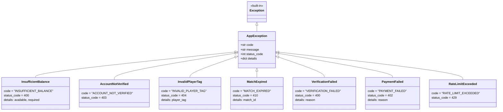

# CR Matchmaking Backend — Architecture Diagrams

> All diagrams use [Mermaid](https://mermaid.js.org/) syntax.
> View in VS Code (Mermaid extension), GitHub, or [mermaid.live](https://mermaid.live).

---

## Table of Contents

1. [System Architecture](#1-system-architecture)
2. [Database ER Diagram](#2-database-er-diagram)
3. [Pydantic Schemas](#3-pydantic-schemas)
4. [Exception Hierarchy](#4-exception-hierarchy)
5. [File / Module Dependency Graph](#5-file--module-dependency-graph)
6. [Planned API Endpoints](#6-planned-api-endpoints)
7. [User Registration & CR Linking Flow](#7-user-registration--cr-linking-flow)
8. [Matchmaking Flow](#8-matchmaking-flow)
9. [Payment Flow](#9-payment-flow)
10. [App Lifespan](#10-app-lifespan)
11. [Configuration Map](#11-configuration-map)
12. [Built vs Missing](#12-built-vs-missing)

---

## 1. System Architecture

How the FastAPI application connects to its external dependencies.

---

## 2. Database ER Diagram

All four tables with columns, types, keys, and relationships.

---

## 3. Pydantic Schemas

All request/response contracts grouped by domain.

---

## 4. Exception Hierarchy

Custom exception tree with HTTP status codes and error codes.

---

## 5. File / Module Dependency Graph

How every source file imports from others.

---

## 6. Planned API Endpoints

Full REST API surface area derived from schemas and domain design.

---

## 7. User Registration & CR Linking Flow

Sequence diagram covering signup through Clash Royale account verification.

---

## 8. Matchmaking Flow

Full lifecycle: queue entry, match creation, battle, verification, and payout.

---

## 9. Payment Flow

Deposit and withdrawal sequences with Stripe integration.

---

## 10. App Lifespan

Startup and shutdown sequence for the FastAPI application.

---

## 11. Configuration Map

All settings grouped by category with defaults.

---

## 12. Built vs Missing

Current project completion status.

---

*Generated for the CR Matchmaking Backend project.*
